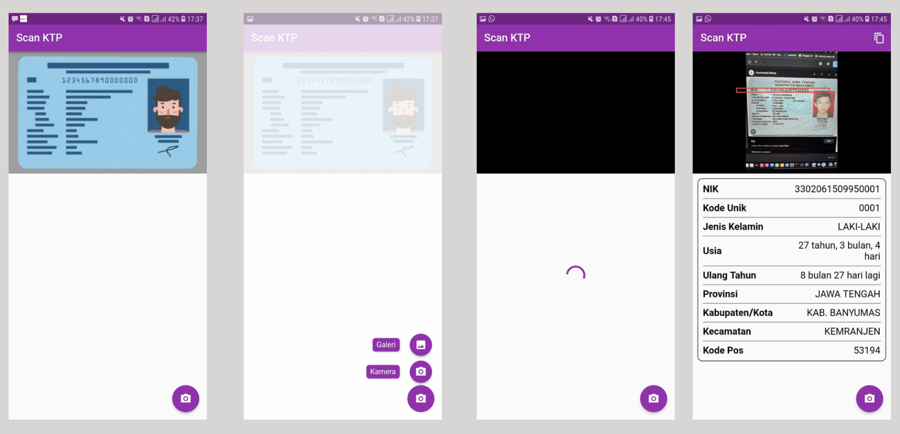

# Scan KTP

NIK Scan is a package to converting Indonesian Identity Card Number into useful informations.
You just call the function .parse and input NIK number in the parameter, then you will get the informations, without internet connection (offline)


## Demo
<table style={border:"none"}>
  <tr>
    <td></td>
  </tr>
  </table>


## Example Code:
```dart
NIKModel result = await NIKValidator.instance.parse(nik: nik);
/// When nik is valid
if (result.valid) {
  print("NIK: ${result.nik}");
  print("UNIQUE CODE: ${result.uniqueCode}");
  print("GENDER: ${result.gender}");
  print("BORNDATE: ${result.bornDate}");
  print("AGE: ${result.age}");
  print("NEXT BIRTHDAY: ${result.nextBirthday}");
  print("ZODIAC: ${result.zodiac}");
  print("PROVINCE: ${result.province}");
  print("CITY: ${result.city}");
  print("SUBDISTRICT: ${result.subdistrict}");
  print("POSTAL CODE: ${result.postalCode}");
}
```

## About Me
Visit my youtube : [https://www.youtube.com/@block7code](https://www.youtube.com/@block7code)

Follow my Github : [GitHub followers](https://github.com/block7code?tab=followers)


